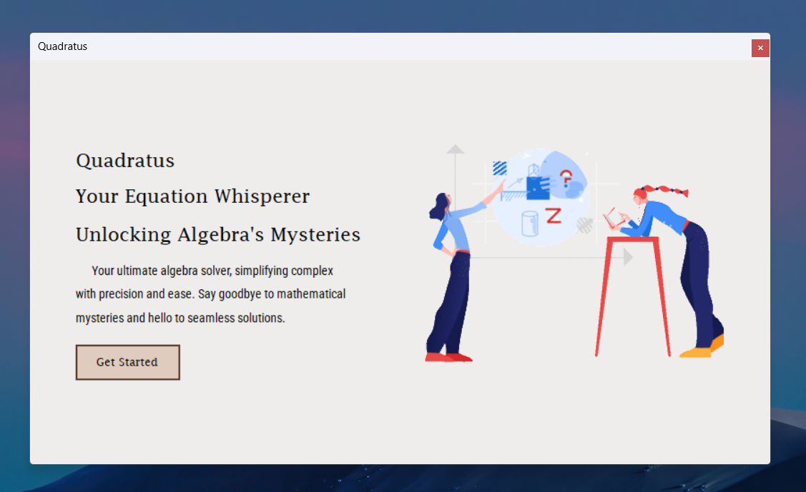

# Getting Started with Quadratus your Equation Whisperer Unlocking Algebra's Mysteries

This project was created by Dariel Avila.

## Description of the system

Your ultimate algebra solver, simplifying complex with precision and ease. Say goodbye to mathematical mysteries and hello to seamless solutions.

## Tech Stack

• C#
• .Net Framework
• OpenAI
• Newtonsoft.Json
• System.Net.Http

